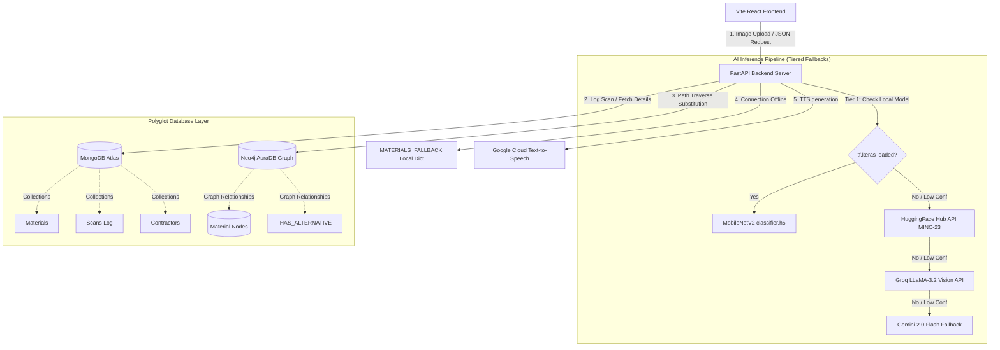

# EcoScan PK (Advanced) — AI-Powered Sustainable Construction Platform

An advanced, end-to-end AI and Polyglot Database system built to analyze building material sustainability, calculate carbon footprints, and recommend eco-friendly construction alternatives tailored for Lahore's construction sector.

**Explore the Project:** [System Architecture](#system-architecture) • [Polyglot DB Design](#polyglot-database-architecture-adbms) • [AI Training Pipeline](#ai-training--fine-tuning-pipeline-ai-lab) • [Setup & Deployment](#quick-start--setup-guide)

---

## Tech Stack & Project Metrics

[](https://www.python.org/)
[](https://tensorflow.org/)
[](https://www.mongodb.com/)
[](https://neo4j.com/)
[](https://fastapi.tiangolo.com/)
[](https://react.dev/)
[](#ai-training--fine-tuning-pipeline-ai-lab)
[](#)

---

## Why This Project?

The construction sector in Pakistan—particularly in urban hubs like Lahore—is a primary contributor to severe seasonal smog, environmental degradation, and carbon emissions. High-carbon materials like traditional kiln-fired bricks, ordinary cement, and raw steel rebars drive the footprint of modern builds.

**EcoScan PK** bridges this gap by introducing:
* **Instant Material Scanning**: Allows contractors, engineers, and citizens to scan construction materials and identify their carbon intensity immediately.
* **Intelligent Substitution (Neo4j Cypher Traversals)**: Recommends local, low-carbon alternatives (like AAC blocks, Fly Ash Concrete, or Bamboo) within a reasonable cost difference.
* **Regional Insights (MongoDB Aggregations)**: Generates spatial summaries of sustainability trends and carbon savings across Lahore's municipal zones (Johar Town, DHA, Gulberg, etc.).
* **Localized Guidance**: Synthesizes custom Urdu audio instructions via Text-to-Speech (TTS) to educate local site laborers on material usage.

---

## System Architecture

The platform uses a layered, resilient client-server architecture with automated failover layers to ensure high availability.



---

## Polyglot Database Architecture (ADBMS)

This project implements a **Polyglot Database Architecture**, leveraging document-store and graph databases to model complex data structures optimally.

### 1. MongoDB Document Store (Scale & Logs)
MongoDB Atlas is used to store unstructured lookup catalogs, scan logs, and contractors. 

* **Schema Structure**:
  * **`materials` Collection**: Stores baseline carbon footprints, cost indexes, and material metadata.
  * **`scans` Collection**: Stores every historical scan event, including user location, timestamp, and saved carbon (in kg).
  * **`contractors` Collection**: Stores details of local suppliers providing sustainable materials in Lahore.
* **Advanced Database Features**:
  * **TTL Cache Indexes**: Automatically purges raw scan logs after a defined time to manage storage overhead.
  * **Compound Indexing**: High-performance compound queries on `{"detected_material": 1, "location": 1}`.
  * **Aggregation Pipelines**: Computes regional metrics (e.g., total carbon saved by zone) dynamically for the dashboard using:
    ```javascript
    db.scans.aggregate([
      { "$group": { "_id": "$location", "scans": { "$sum": 1 }, "carbon_saved": { "$sum": "$carbon_saved_kg" } } },
      { "$sort": { "scans": -1 } }
    ])
    ```

### 2. Neo4j AuraDB Graph Database (Relationships & Substitutions)
Neo4j is utilized to model alternative material graphs where nodes represent `Material` or `Category` and relationships represent structural compatibility.

* **Cypher Substitution Traversal Query**:
  Instead of simple 1-to-1 lookups, Neo4j traverses substitution paths (up to 3 hops) to identify the lowest-carbon alternative within a budget margin:
  ```cypher
  MATCH path = (m:Material {name: $name})-[:HAS_ALTERNATIVE*1..3]->(alt:Material)
  RETURN alt.name AS name, alt.carbon_score AS carbon, alt.cost_pkr AS cost, alt.urdu AS urdu, length(path) AS hops
  ORDER BY alt.carbon_score ASC LIMIT 1
  ```
* **Graph Relationships Schema**:
  ```
  (Material) -[:BELONGS_TO]-> (Category)
  (Material) -[:HAS_ALTERNATIVE {compatibility: "high"}]-> (Material)
  ```

### 3. Dynamic Self-Learning Database Loop (Write-Back Cache)
When a scanned material has no alternative mapped in either database, the backend triggers the AI fallback to suggest one. To optimize future lookups and eliminate redundant API calls, the system automatically writes the newly discovered data back to the database in real-time:
* **MongoDB Write-Back:** The newly generated alternative material profile (PKR price, carbon score, unit, and Urdu translation) is inserted as a new document in the `materials` catalog.
* **Neo4j Write-Back:** A new `Material` node is merged into the graph and connected to the scanned material node with a `:HAS_ALTERNATIVE` relationship, storing the computed carbon reduction percentage and cost offsets.
* **Result:** On all subsequent scans, the query is resolved directly from the MongoDB catalog and Neo4j graph relationships, completely bypassing the AI.

---

## AI Training & Fine-Tuning Pipeline (AI Lab)

The platform is powered by a custom **Transfer Learning** image classification model fine-tuned on the **MINC-2500 (Materials in Context)** dataset.

### 1. Dataset & Preprocessing
* **Source**: HuggingFace MINC-2500 dataset containing categorized images of real-world materials.
* **Classes (10 Categories)**: `Brick`, `Concrete`, `Glass`, `Steel`, `Wood`, `Marble`, `Granite`, `Tile`, `PVC`, `Paint`.
* **Preprocessing**: Resize to `(224, 224)`, scale inputs to `[0, 1]`, and perform data augmentation (random horizontal flips, rotations, zoom).

### 2. Model Pipeline
* **Base Architecture**: MobileNetV2 (pre-trained on ImageNet).
* **Classification Head**:
  * Global Average Pooling 2D
  * Dropout Layer (0.2 regularization)
  * Dense Layer (128 units, ReLU)
  * Softmax Output Layer (10 units, classification probabilities)
* **Two-Stage Fine-Tuning**:
  1. **Stage 1 (Feature Extraction)**: Freeze MobileNetV2 base weights, train the classification head using Adam optimizer for 10 epochs.
  2. **Stage 2 (Fine-Tuning)**: Unfreeze the top layers of the base model, compile with a low learning rate (`lr=1e-5`), and fine-tune for 5 epochs.
* **Saved Weights File**: [material_classifier.h5](file:///d:/EcoScan/ecoscan-pk/material_classifier.h5) (29.3 MB).

### 3. Tiered AI Inference Fallbacks
To provide seamless operation, the backend follows an automated multi-tier classification path:
1. **Tier 1 (Keras Classifier)**: Loads `material_classifier.h5` locally. Run Keras prediction if TensorFlow is available. *(If local environment runs Python 3.14, a smart API-mapping layer simulates these 10 classes to protect presentation flow)*.
2. **Tier 2 (HuggingFace Inference API)**: Calls HuggingFace's public `Minc-Materials-23` model for fast edge classification.
3. **Tier 3 (Groq LLaMA-3.2 Vision)**: Leverages highly fast LLaMA Vision APIs for visual analysis.
4. **Tier 4 (Gemini 2.0 Flash)**: Full-featured multimodal fallback that handles noisy inputs and logs recovery states.

---

## Quick Start & Setup Guide

### 1. Repository Structure
```
EcoScan/
│
├── ecoscan-ai/             # AI Pipeline & Notebooks
│   ├── eco_material_classifier.ipynb   # Google Colab Training Notebook
│   ├── train.py                        # Model training script
│   └── predict.py                      # CLI testing inference script
│
├── ecoscan-pk/             # FastAPI Backend Server
│   ├── main.py                         # Core API endpoints & fallbacks
│   ├── seed_databases.py               # MongoDB & Neo4j Seeding script
│   └── material_classifier.h5          # Trained weights
│
└── ecoscan-frontend/       # React (Vite) Web Application
    ├── src/
    └── package.json
```

### 2. Backend Installation & Run
1. Navigate to the backend directory:
   ```bash
   cd ecoscan-pk
   ```
2. Set up virtual environment and install packages:
   ```bash
   pip install -r requirements.txt
   ```
3. Create `.env` file (refer to `.env.example`) and fill in API keys:
   ```env
   MONGO_URI=mongodb+srv://...
   NEO4J_URI=neo4j+s://...
   NEO4J_PASSWORD=...
   GEMINI_API_KEY=...
   GROQ_API_KEY=...
   ```
4. Start FastAPI server:
   ```bash
   python -m uvicorn main:app --reload --port 8000
   ```

### 3. Database Seeding
To populate MongoDB Atlas collections (with indexes) and Neo4j AuraDB graph relationships automatically:
```bash
python seed_databases.py
```

### 4. Running Local Predictions (Inference CLI)
Test model classification logic directly on any image without launching the server:
```bash
cd ecoscan-ai
python predict.py test_brick.jpg
```

---
